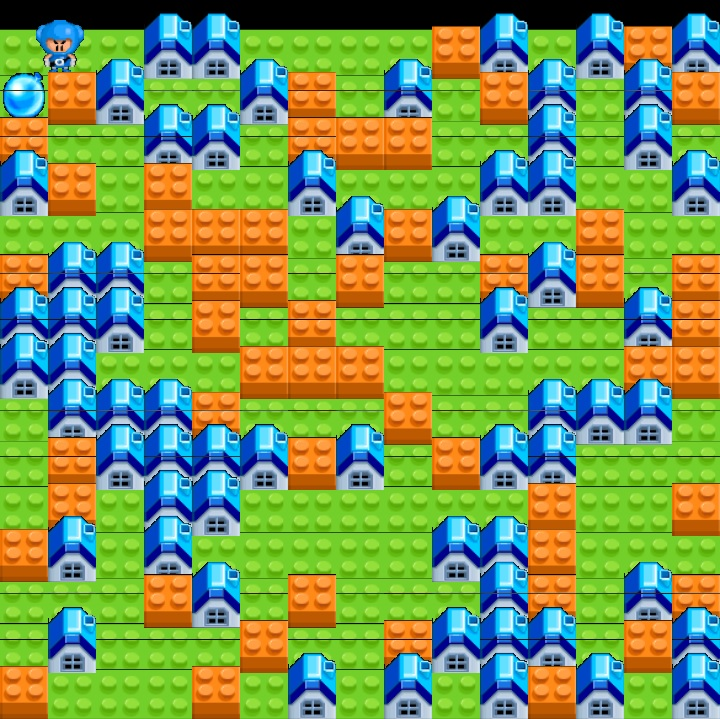

# Poptag

A recreation of Nexon's famous *Crazy Arcade*, my childhood favorite.

*This project is actively under development. No documentation is ready yet.*

The game will be available for Windows and Linux.

**Game state engine**: Created from scratch!

**Graphics**: OpenGL + GLFW + GLAD + STB image loader

**Networking** (Coming soon): Socket.IO

**Build**: CMake

**Screenshot** [6/19/2020]:

